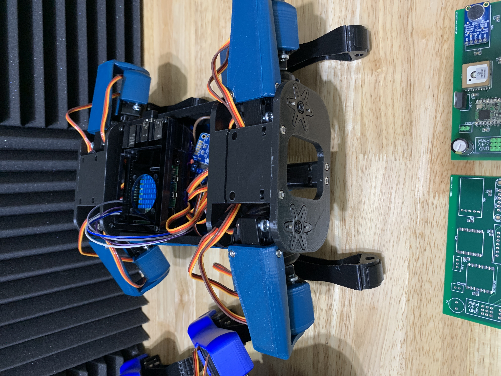
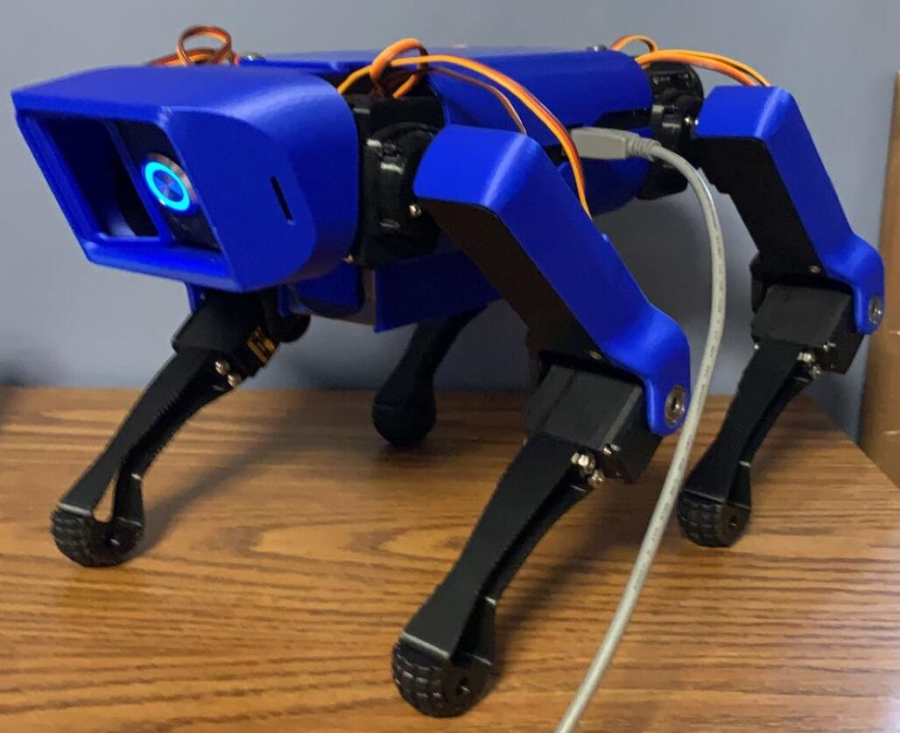

# SPARKE (Servo Powered Autonomous Robot with Kinematic Enhancements)
## Project Overview
This project aims to replicate the functionality of the Boston Dynamics Spot robot on a smaller scale by leveraging the power of ROS2 and Gazebo simulation. I started this project as a high school senior to help assist my recovery from spinal surgery.

## Current Progress
This project is a work in progress. As a full-time college undergraduate, I find it challenging to work on it consistently. There are often large gaps between updates.

### Gazebo Simulation
A gazebo simulation is being developed for SPARKE. As of August 22, 2023, the simulation is working on humble! Instructions on how to run the simulation can be found in the doc folder. Please keep in mind that the simulation is still very much a WIP. The inertia, PID gains, etc, need to be tuned.

### Kinematics Solver
I've created an inverse kinematics solver for SPAKRE, which can be found in this repo: https://github.com/Infinite-Echo/sparkeKinematics.

### Gait Generation
Currently, the gait generation code used is a ROS2 port of mik4192's Spot Micro repo (https://github.com/mike4192/spotMicro). All I did was convert the code from ROS to ROS2, the underlying code is the same. Eventually, I hope to replace them with custom dynamic gait planners.

## Roadmap

### Reinforcement Learning
I have been working on a reinforcement learning environment to create a gait generator for SPARKE, which can be found in this repo: https://github.com/Infinite-Echo/SparkeEnvs. I spent most of the Summer of 2024 working on reinforcement learning, and it is not finished yet. The basic environment is complete, but the reward function needs tuning.

### Nav2
I have worked on many projects with Nav2 and am familiar with the framework. Once I am satisfied with SPARKE's gait, I will add Nav2 to this project.

#### SLAM
I purchased an RPLidar A1 a while ago, and I plan to use it for SLAM.

### Custom Hardware
I have been developing my own Nvidia Jetson Orin Nano carrier board. However, due to the recent price change, the Jetson Orin Nano is out of stock everywhere, and I am unwilling to risk my only module getting burnt by testing my carrier board. Therefore, I cannot test the current carrier board revision until I receive the module I back-ordered. I will make the repo public containing the KiCad files soon.

### Follow the Leader
One of the major features I want to add is the ability to make the robot follow a designated leader. Once implemented, the robot can lock onto a person and autonomously navigate while avoiding obstacles. However, I will not work on this until the gait planning is reliable and the robot can handle complex environments.

## Electronics
Currently, V2 runs on a Raspberry Pi 4B 8gb. The servo motors are controlled by a PCA9685 PWM I2C driver (https://www.adafruit.com/product/815). Each leg has three motors: shoulders/hips, elbows/knees, and wrist/ankles. 

## 3D Models
SPARKE's 3D models come from the SpotMicroAI project.
3D Models: https://gitlab.com/public-open-source/spotmicroai/3dprinting

## How to Contribute
While this project is currently a personal endeavor, I'm open to collaboration and contributions. If you're passionate about robotics, ROS2, Gazebo simulation, or any related field, feel free to reach out. Let's discuss potential areas of collaboration and innovation.

Contact
If you're interested in this project or have any questions, you can reach out to me via email at InfiniteEchoRobotics@gmail.com. I'm looking forward to connecting with fellow enthusiasts and creators!

> Note: This README provides an overview of the project and its current status. For detailed technical information, code documentation, and updates, please refer to the project's source code and documentation.
